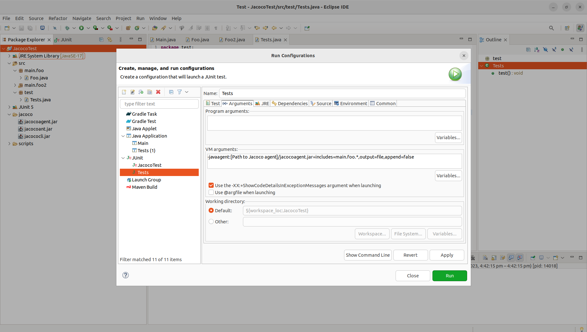

# JacocoTest

## Run Test

Before Running the tests you must attach the Java Agent to the JVM
Here is a screenshot on where to do this in eclipse along with the command
The jacocoagent.jar file is located in the jacoco folder

`-javaagent:[Path to Jacoco Agent]/jacocoagent.jar=includes=main.foo.*,output=file,append=false`

Now running the JUnit test will generate a jacoco.exec file

## Generate Coverage Report

At the head of the project cd into the scripts folder and run the run.sh file with the command
`./run.sh`

This will generate the coverage report under report in the jacoco file and open the index.html file

